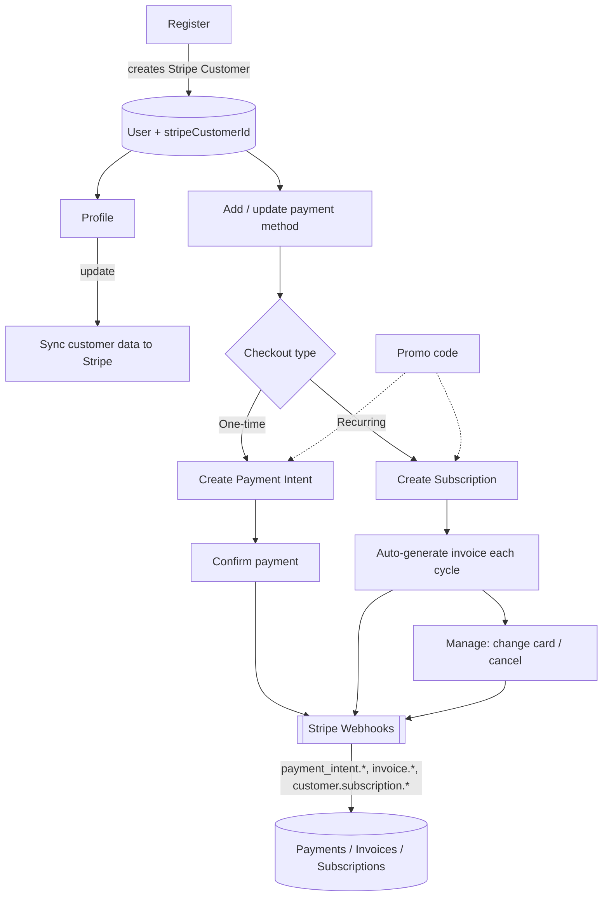

# Stripe Billing Service

A backend billing service built on the Stripe API — one-time payments, recurring subscriptions, saved payment methods, promo codes, and webhook-driven reconciliation, on top of an Express/PostgreSQL/Sequelize stack.

## Features

- **Customers** — account registration creates a linked Stripe Customer, kept in sync on profile updates.
- **Payment methods** — add, update, and select saved cards per customer.
- **One-time payments** — Payment Intents, either against a saved payment method or one entered at checkout.
- **Subscriptions** — plan selection, recurring billing cycles, automatic invoice generation, upgrade/cancel flows.
- **Promo codes** — coupon/promotion application on both one-time and recurring payments.
- **Webhooks** — a single endpoint reconciles payment, invoice, and subscription state from Stripe's events, so the database never has to guess at payment status.
- **Auth** — JWT access tokens with refresh-token rotation and a blacklist for revocation.

## Architecture



The webhook endpoint is the single source of truth for payment state — the API never marks a payment or invoice as paid on the strength of a client-side response alone; it waits for the corresponding Stripe event.

## Tech stack

Express · PostgreSQL · Sequelize · Redis · BullMQ · Stripe · JWT

## Setup

```bash
cp .env.example .env   # fill in Postgres, JWT, and Stripe credentials
npm install
npm run dev
```
